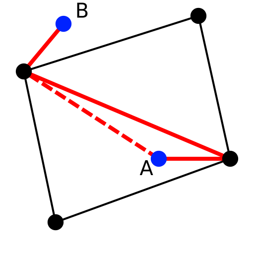
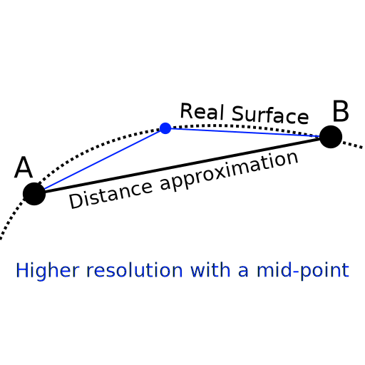
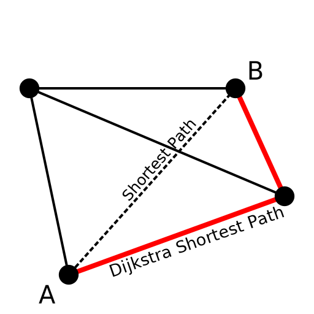

[![Build Status][docker_status]][docker_link]

[docker_status]: https://github.com/Mizux/sm_challenge/workflows/Docker/badge.svg?branch=main
[docker_link]: https://github.com/Mizux/sm_challenge/actions?query=workflow%3A"Docker"

# Introduction
Simple [Modern CMake](https://cmake.org/)/C++ App using libigl to draw shortest path.<br>

## Questions
Challenge can be found in [doc/sm_1.png](doc/sm_1.png) and [doc/sm_2.png](doc/sm_2.png).

1) I've just implemented a Dijkstra algorithm using a priority queue, lack of time for a better
solution and bench.<br>
note: Take a look in [Path.cpp](App/src/Path.cpp) for implementation.

2) Using a simple scan (`O(n)` algorithm), I've associated each points to the closest vertex of M.<br>
Then when initializing the distance from source nodes, use this distance instead of zero.

Potential improvement: I should find the triangle face whose point belongs to,
then run the shortest path using each triangle's vertices as sources to avoid potential "U turn".
see: 

3) Use a `const std::function<double(Eigen::VectorXd, Eigen::VectorXd)>&` as parameter of my `shortest_path()`
method.<br>
note: Take a look in [Menu.cpp](App/src/Menu.cpp) for usage with a lambda.

4) To have the correct distance from all vertices of M,
simply compute until the priority queue is empty instead of stoping when the
target node is "pop()" from the queue.

5) Done by using a `const std::vector<Eigen::VectorXd>&` for passing a list of source points.
Then in the initialisation of the distances and the queue use all points.

## Bonus

1) By using the edges:
* We ignore the surface curvature between vertices i.e. using a straigth line
  from vertex to vertex.
  see: 
* We limit yourself to cut through the triangle face but instead follow
  the edges which is not the shortest path.
  see: 
Using higher resolution mesh or subdivision will mitigate these errors.

2) The main idea is to use the triangle faces instead of vertices/edges to compute
the shortest path, then use a 2D funnel algorithm (implemented by most popular 2D nav-mesh libraries).

Steps would be:
- Use triangle's centroid to compute the dijkstra shortest path.
- then unwrap this "triangle path" from the source point to the target point on
  a 2D plane.
- then run the funnel algorithm on it to get the point on each "portal" (edge
  between two consecutive triangles in the shortest path).

3) To "avoid" holes you can "disable/mask" triangle with an hole so the
algorithm won't pass through. i.e. mark these triangles as obstacles.

## Build
This project should run on Linux, Mac and Windows.

### CMake Dependencies Tree
This CMake project is composed of few executables with the following dependencies:
```sh
libigl: eigen3 opengl glfw imgui
app: libigl
```
note: All dependencies are built in static to have one standalone executable `App`.  

### Project directory layout
Thus the project layout is as follow:
```
.
├── CMakeLists.txt
├── patches
│   └── libigl.patch
└── App
    ├── CMakeLists.txt
    └── src
        ├── Menu.hpp
        ├── Menu.cpp
        └── main.cpp
```

### C++ Project Build
To build the C++ project, as usual:
```sh
cmake -S. -Bbuild -DCMAKE_BUILD_TYPE=Release
cmake --build build --config Release
CTEST_OUTPUT_ON_FAILURE=1 cmake --build build --config Release --target test
```

### Build directory layout
Since we want to use the [CMAKE_BINARY_DIR](https://cmake.org/cmake/help/latest/variable/CMAKE_BINARY_DIR.html) to generate the binary package.  
We want this layout (tree build --prune -P "*.a|FooApp"):
```
build
├── lib
│   ├── libigl.a
│   ├── libigl_opengl.a
│   ├── libigl_opengl_glfw.a
│   ├── libigl_opengl_glfw_imgui.a
│   ├── libglfw3.a
│   └── libimgui.a
└── bin
   └── App
```

## License
See the [LICENSE](LICENSE) file for details.
